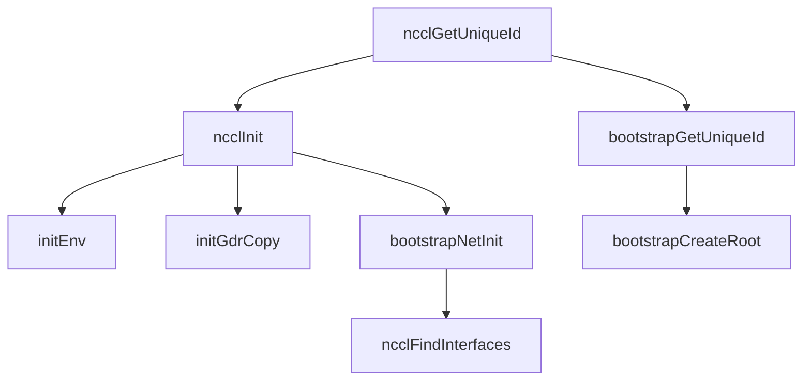
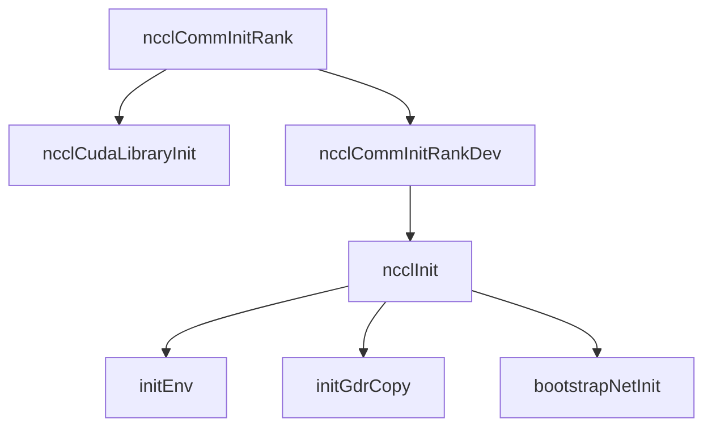

```mermaid
flowchart TD
  A[ncclGetUniqueId] --> B[ncclInit]
  A --> C[bootstrapGetUniqueId]
  B --> D[initEnv]
  B --> E[initGdrCopy]
  B --> F[bootstrapNetInit]
  F --> G1[ncclFindInterfaces]
  C --> G[bootstrapCreateRoot]
```

```mermaid
flowchart TD
  A[ncclCommInitRank] --> B1[ncclCudaLibraryInit]
  A --> B2[ncclCommInitRankDev]
  B2 --> C1[ncclInit]
  C1 --> D1[initEnv]
  C1 --> D2[initGdrCopy]
  C1 --> D3[bootstrapNetInit]
```

使用到的线程：

- "NCCL BootstrapR"
