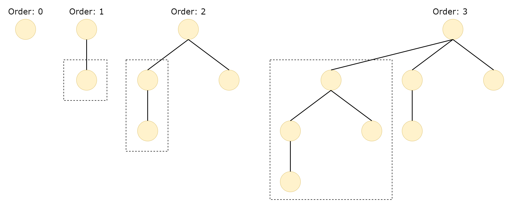
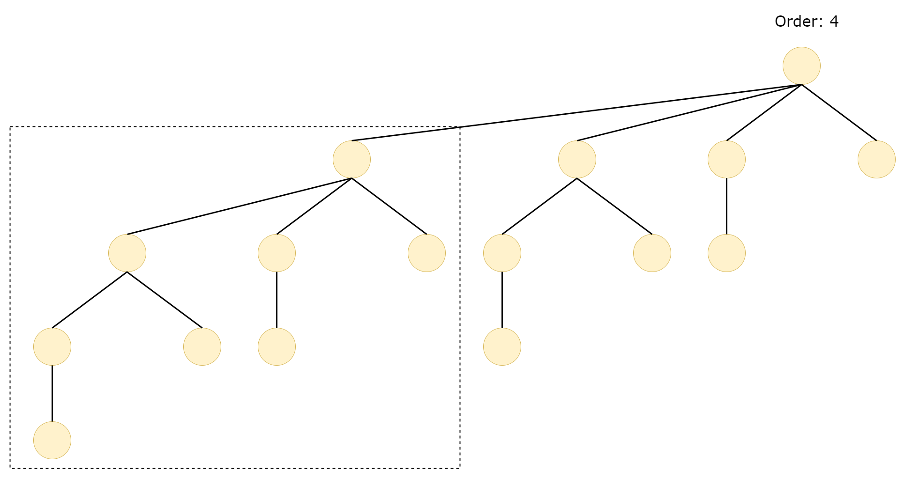

## 1. 二项树的定义

一般，采用递归的形式来定义二项树。

我们假定$B_k$代表第$k$颗二项树，也成为第k阶二项树：

- $B_0$ 是一颗只有一个节点的树。
- 对于$k \geq 1$， $B_k$ 是通过将两颗$B_{k-1}$树链接起来形成的，其中一颗$B_{k-1}$树的跟节点成为另一颗$B_{k-1}$树的最左子节点。

## 2. 二项树的性质

- **节点数**：二项树$B_k$的节点数为$2^k$。
- **高度**：二项树$B_k$的高度为$k+1$。
- **度数**：二项树$B_k$的根节点的度数为$k$，且树中每个节点的度数都不超过$k$。

- **节点深度**：深度为$d$的节点数为$C^d_k$, 其中$C^d_k$是组合数，表示从$k$个不同元素中选取出$d$个元素的组合数。
- 从左往右，根的第i个子节点是一颗阶为$k-i$的二项树

## 3. Reference

1. https://rkgiitbh.github.io/data-structures.github.io/HTML/binomialTrees.html
2. https://en.wikipedia.org/wiki/Binomial_heap
